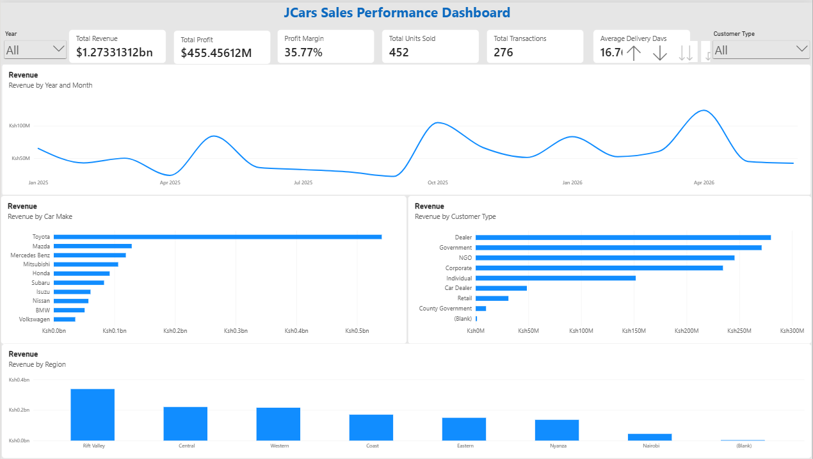
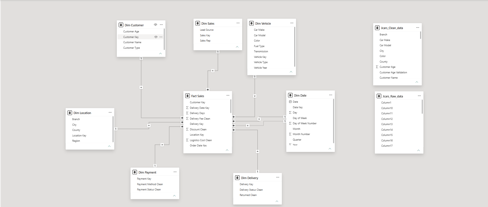

# JCars Sales Performance Analysis — Power BI

## Project Overview

This project analyzes JCars sales, profitability, customer, vehicle, location, sales, payment, and delivery data using Microsoft Power BI.

The project started with a raw dataset containing **276 transaction records and 46 columns**. The dataset contained missing values, inconsistent categories, duplicate Order IDs, mixed date formats, invalid date values, and other data-quality issues.

The objective was to transform the raw data into a reliable analytical model and interactive Power BI report that could answer practical business questions around sales performance, revenue, profitability, and delivery operations.

---

## Business Questions

The analysis was designed to answer questions such as:

* How much revenue was recorded in each year?
* Which vehicle makes generated the most recorded revenue?
* How much revenue was generated by each customer type?
* Which regions generated the most recorded revenue?
* How many units did each vehicle make sell?
* How does recorded profit and profit margin vary by vehicle make?
* Which lead sources generated the most transactions and recorded revenue?
* How does revenue per unit vary across lead sources?
* How are transactions distributed across delivery statuses?
* How do delivery times and delivery fees vary by delivery status?
* What proportion of transactions were returned?

---

## Project Workflow

The project followed an end-to-end analytics workflow:

**Data Investigation → Data Cleaning → Validation → Data Modelling → DAX → Dashboard Development → Business Insights**

### 1. Data Investigation

The raw dataset was first investigated using Excel to understand:

* Dataset grain
* Column structure
* Data types
* Missing values
* Duplicate identifiers
* Category inconsistencies
* Date anomalies
* Relationships between attributes
* Potential data-quality risks

The investigation established that each row represented a **transaction/order record**.

A key finding was that `Order ID` was not unique. Several Order IDs appeared more than once with different attributes, so the duplicate records were retained rather than removed.

---

### 2. Data Cleaning & Validation

Power Query was used to clean and transform the dataset.

Key activities included:

* Standardizing inconsistent category values
* Converting columns to appropriate data types
* Cleaning and validating date fields
* Handling missing and invalid values
* Creating a unique `Transaction Key`
* Creating `Delivery Days`
* Separating descriptive attributes from measurable transaction fields
* Validating the transformed dataset

The final dataset retained all **276 transaction records**, with **0 technical Power Query errors**.

Data-quality anomalies that could not be reliably resolved using the source data were retained and documented rather than being changed based on assumptions.

---

### 3. Data Modelling

The cleaned dataset was transformed into a **star schema** consisting of one fact table and seven dimension tables.

### Fact Table

**Fact Sales**

Contains the transaction-level measurable information, including:

* Transaction Key
* Order ID
* Customer Key
* Vehicle Key
* Location Key
* Sales Key
* Payment Key
* Delivery Key
* Order Date Key
* Delivery Date Key
* Units Sold
* Unit Selling Price
* Unit Cost
* Discount
* Delivery Fee
* Logistics Cost
* Revenue Recorded
* Delivery Days

### Dimension Tables

* Dim Customer
* Dim Vehicle
* Dim Location
* Dim Sales
* Dim Payment
* Dim Delivery
* Dim Date

Relationships were configured as **one-to-many with single-direction filtering**.

The Date dimension uses:

* **Order Date → active relationship**
* **Delivery Date → inactive relationship**

This allows the same Date dimension to support both order and delivery date analysis.

---

## 4. DAX Measures

Measures were created to support dynamic analysis of the business questions.

Examples include:

```DAX
Total Revenue = SUM('Fact Sales'[Revenue Recorded])
```

```DAX
Total Units Sold = SUM('Fact Sales'[Units Sold])
```

```DAX
Total Transactions = COUNTROWS('Fact Sales')
```

```DAX
Total Profit = [Total Revenue] - [Total Cost]
```

```DAX
Profit Margin =
DIVIDE(
    [Total Profit],
    [Total Revenue],
    0
)
```

```DAX
Average Delivery Days =
AVERAGE('Fact Sales'[Delivery Days])
```

Additional measures were created for:

* Total Cost
* Average Unit Selling Price
* Average Discount
* Total Delivery Fees
* Total Logistics Cost
* Revenue Per Unit
* Average Units per Transaction
* Profit per Transaction
* Delivery Fee % of Revenue

---

## 5. Dashboard

The final Power BI report contains three analytical pages.

### Executive Overview

Provides a high-level view of:

* Revenue
* Profit
* Profit Margin
* Units Sold
* Transactions
* Average Delivery Days
* Revenue trends
* Revenue by vehicle make
* Revenue by region
* Revenue by customer type



---

### Sales & Profitability

Focuses on:

* Profit by vehicle make
* Profit margin by vehicle make
* Units sold by vehicle make
* Revenue by lead source
* Transactions by lead source
* Revenue per unit by lead source


---

### Delivery & Operations

Focuses on:

* Transactions by delivery status
* Average delivery days
* Delivery fees
* Returned versus non-returned transactions


---

### Data Model

The Power BI model uses a star-schema structure with `Fact Sales` at the centre and seven supporting dimensions.



---

## Key Findings

### Vehicle Performance

Toyota recorded approximately **$540.8M in revenue** from **137 units**, contributing approximately **$234.0M in recorded profit**.

Mazda recorded approximately **$128.5M in revenue** from 67 units and had a recorded profit margin of approximately **57%**.

BMW recorded approximately **$50.9M in revenue** from 11 units but had a recorded profit margin of approximately **-2%**, indicating that the recorded vehicle acquisition cost exceeded recorded revenue for the BMW transactions and warrants further investigation.

### Regional Performance

Rift Valley recorded approximately **$337.1M** in revenue, followed by Central at approximately **$219.7M** and Western at approximately **$215.0M**.

### Lead Sources

Instagram generated approximately **$263.1M** across 41 transactions.

Facebook generated approximately **$223.9M** across 38 transactions.

Corporate Tender generated 34 transactions but approximately **$102.7M in revenue**, giving it a lower revenue per unit than several other lead sources.

### Delivery Operations

There were **146 transactions recorded as Delivered**, while 44 were In Transit and 37 were Cancelled.

The dataset also contains inconsistencies between delivery status and delivery dates, including records with delivery dates missing for transactions marked as Delivered.

### Returns

The report recorded:

* 88 returned transactions
* 168 non-returned transactions
* 20 transactions with missing return information

The missing return values represent approximately **7.25% of all transactions**.

---

## Data Quality Considerations

Several limitations were identified during the analysis:

* `Order ID` is not unique, so a separate `Transaction Key` was created.
* There is no stable Customer ID in the source data.
* There is no separate Vehicle ID.
* Several fields contain missing or invalid values.
* Some date records contain invalid or incomplete information.
* Four records contain delivery dates earlier than their order dates.
* Delivery status and delivery-date combinations contain inconsistencies.
* Sales representative names contain possible naming variants, but the source data does not provide enough evidence to determine whether shortened and full names represent the same person.
* Some vehicle records contain unusual or potentially truncated values.
* The profitability calculation defines `Total Cost` as vehicle acquisition cost (`Units Sold × Unit Cost`). Delivery fees and logistics costs are analysed separately.

Where the source data did not provide enough evidence to make a reliable correction, the value was retained and documented rather than changed based on assumptions.

---

## Tools & Skills

**Tools**

* Microsoft Excel
* Power Query
* Microsoft Power BI
* DAX
* Git & GitHub

**Skills demonstrated**

* Data investigation
* Data cleaning
* Data validation
* Data transformation
* Star-schema modelling
* Relationship design
* DAX measures
* Data visualization
* Business-question analysis
* Dashboard design
* Data-quality assessment
* Portfolio documentation

---

## Project Files

```text
JCars-Sales-Performance-Analysis/
│
├── Data/
│   └── J_Cars.pbix
│
├── Images/
│   ├── Overview.png
│   ├── Sales And Profitability.png
│   ├── Delivery And Operations.png
│   └── Model.png
│
├── documentation/
│   └── project-overview.md
│
└── README.md
```

## Conclusion

This project demonstrates an end-to-end approach to transforming a raw business dataset into a structured analytical solution.

The focus was not only on building visuals, but on understanding the data, identifying quality issues, designing an appropriate data model, creating reusable DAX measures, and translating the results into business-relevant insights.
